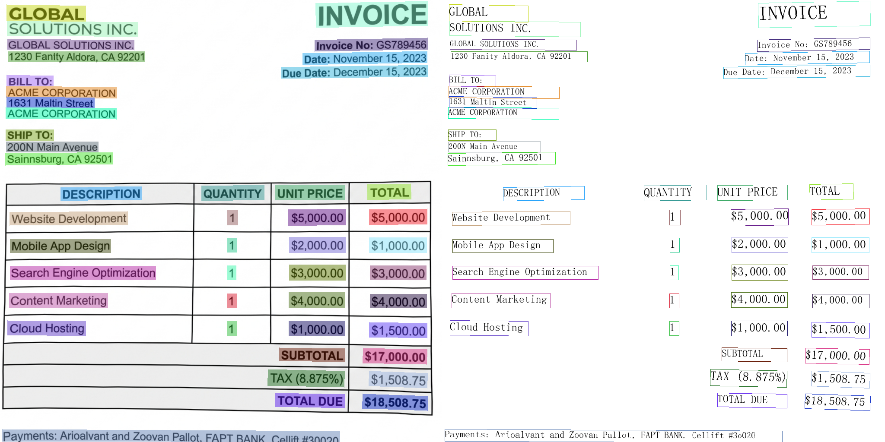

# 🛡️ OCR-Docker-Framework
### **High-Performance Optical Character Recognition & Performance Auditing Suite**
**An opinionated, production-ready OCR engine with automated performance validation.**

[](https://huggingface.co/spaces/mauryasameer/OCR)
[](https://github.com/mauryasameer/ocr_docker/actions)


## 📖 Overview
> "In OCR, 'it reads' is not a valid test result. Accuracy is the only metric."

This framework automates the OCR validation process that professional applications require — turning raw pixel data into structured, audited text evidence. Built to be **modular**, **testable**, and **deployable**.

### **Sample Extraction**
*(The automated PaddleOCR engine rendering bounding boxes for auditing)*



This framework is **production-ready**, optimized for **containarized environments**, ensuring that your data remains secure while providing high-accuracy text extraction.

### **The Problem it Solves**
Many OCR implementations are "black boxes." This framework provides an **audit trail** for every extraction, allowing you to measure **F1 Score** and **CER** (Character Error Rate) against your own gold-standard datasets.


## 📂 Project Structure
```text
ocr_docker/
├── .github/
│   └── workflows/      # Automated sync to Hugging Face Spaces
├── core/
│   ├── evaluators/     # F1 Score & CER character-level metrics
│   ├── ocr_engine.py   # High-level PaddleOCR orchestrator
│   └── utils.py        # Persistence & reporting utilities
├── data/
│   └── gold_standard/  # Reference images and ground-truth JSON
├── reports/            # Generated audit trails (JSON/Markdown)
├── scripts/
│   └── run_benchmark.py # CLI Entry Point for performance auditing
├── tests/              # Pytest unit testing suite
├── app.py              # Gradio web interface (HuggingFace Spaces)
├── requirements.txt    # Production dependencies
└── requirements-dev.txt # Test-only dependencies
```


## 🛠️ The Core Modules

### **1. Accuracy Evaluator (F1 Score)**
Standard text extraction metrics focus on word overlap. This module ensures that every word in the source document is accurately represented, penalizing omissions and false positives.

### **2. Character Error Rate (CER)**
For high-precision documents, we measure the Levenshtein distance at the character level to identify subtle misreadings (e.g., '8' vs 'B').

### **3. Audit Trail Reporting**
Generates a "Committee-Ready" report in `reports/` following every benchmark, providing a timestamped record of model performance — essential for tracking model health under production load.


## ⚖️ License
Distributed under the Apache License 2.0. See `LICENSE` for more information.
Architecture inspired by the `llm_eval` framework for professional ML auditing standards.
